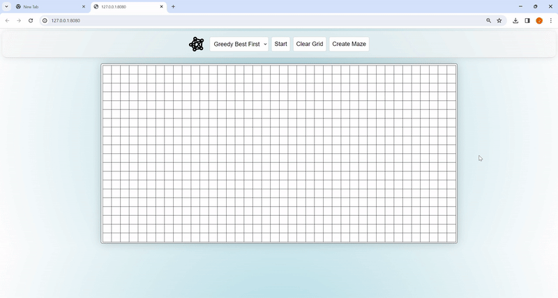

# PathfinderVis

PathfinderVis is a web-based visualization tool that demonstrates the functionality of classic pathfinding algorithms such as A*, Dijkstra's, and Greedy algorithms. The tool provides a visual interface to understand how these algorithms traverse a grid to find the shortest path from a start node to an end node, considering obstacles and different terrains.

## Features

- **Interactive Grid:** Set the start node with a left mouse click and the end node with a right mouse click on the grid.
- **Obstacle Creation:** Toggle the presence of obstacles on the grid by holding the middle mouse button and dragging across cells.
- **Clear Grid:** Reset your grid to its initial state with the "Clear Grid" button, removing all nodes and obstacles.
- **Maze Generation:** Click the "Create Maze" button to add a randomly generated maze to your grid.
- **Algorithm Visualization:** Begin the pathfinding visualization by pressing the "Start" button, and stop it at any time with the "Stop" button.

## Video Demonstration



This animated demonstration showcases the PathfinderVis tool in action, highlighting its features and the visualization of the pathfinding algorithms.

## Getting Started

To run PathfinderVis, ensure you have Docker installed and use the following command in the root of the project directory:

```bash
docker-compose up
```

After starting the application, open your web browser and visit http://127.0.0.1:8080/ to interact with PathfinderVis.